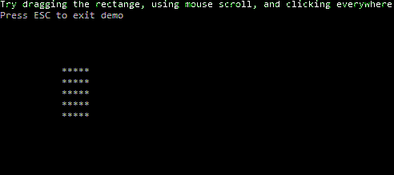
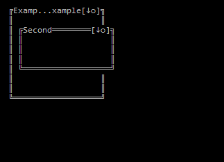

## Difference between original Termbox and this modification
Please, see original termbox at https://github.com/nsf/termbox-go. This modification adds a few mouse events (currently new events are available only in Windows):
* EventMousePress - mouse button pressed
* EventMouseReleased - mouse button release
* EventMouseMove - mouse cursor changed its postion
* EventMouseClick - the event is emitted right after EventMouseRelease if EventMouseRelease coordinates equal the last EventMousePress event
* EventMouseScroll - mouse vertical scroll event

EventMouse event is not used in Windows mode, in *nix mode EventMouse is emitted instead of EventMousePress, EventMouseRelease, and EventMouseClick.

__New demo__: (./_demos/mouse_demo.go) shows you how to use the new events to create draggable objects:

One more example of the new features (window interface):

### Installation
Install and update this go package with `go get -u github.com/VladimirMarkelov/termbox-go`

